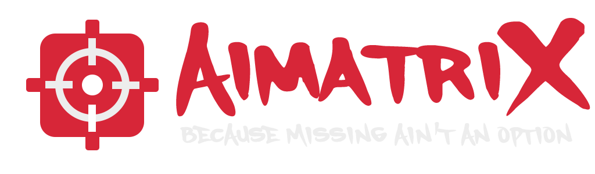

# AimatriX

**AimatriX** is a lightweight, customizable crosshair overlay designed for gamers, streamers, and developers seeking precision without compromise. Whether you're playing a first-person shooter, lining up a trickshot, or just need a consistent visual guide, AimatriX provides a clean, always-on-top crosshair that works with any game — no mods, no overlays, no nonsense.

---

## 🎯 Features

- **Always-on-top overlay window**: Ensures your crosshair remains visible across all applications.
- **Custom .png crosshair support**: Personalize your crosshair by uploading your own transparent PNG images.
- **Crosshair Gallery**: Browse and select from a built-in collection of crosshairs.
- **Settings file**: AimatriX remembers your last-used crosshair and settings between launches.
- **System tray icon**: Easily exit the application from the system tray.
- **Splash screen**: A new loading screen displays while the app boots up.

---

## 🚀 Version History

### v0.3 – Crosshair Gallery is Here!
- 🖼️ **Crosshair Gallery**: Browse a built-in collection of crosshairs and swap instantly.
- 🚀 **Splash Screen**: A new loading screen shows while the app boots up.

### v0.2 – Now with Custom Crosshairs!
- 🖼️ **Custom .png crosshair support**: Drop in your own image and use any design you want.
- 💾 **Settings file**: AimatriX now remembers your last-used crosshair and settings between launches.

### v0.1 – First Release is Live!
- ✅ **Displays a default crosshair**, always centered and always visible.
- 💤 **Runs silently in the background** with minimal CPU usage.
- 🖥️ **System tray icon** to exit the app at any time.

---

## 🔜 Upcoming Features (v0.4)

- 🎮 **Hotkeys**: Toggle the crosshair or reload it on the fly.
- 🧩 **Improved Gallery UI**: Enhanced layout and preview support for the crosshair gallery.

---

## 📥 Download

You can download the latest release from the [Releases](https://github.com/itsmedeimo/AimatriX/releases) page.

---

## 💬 Join Our Community

Join our [Discord server](https://discord.com/invite/nNpy2PjYC6) to get access to the latest news, updates, and our custom crosshair gallery, including user-submitted designs.

---

## 📄 License

This project is licensed under the MIT License. See the [LICENSE](LICENSE) file for details.
