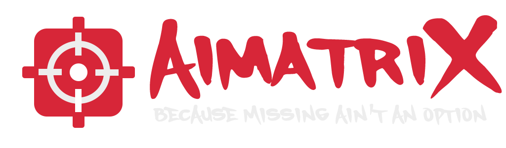

## 🎯 About AimatriX
**AimatriX** is a lightweight, customizable crosshair overlay designed for gamers, streamers, and creators who want precision without compromise.

Whether you're playing a first-person shooter, lining up a trickshot, or just need a consistent visual guide, AimatriX gives you a clean, always-on-top crosshair that works with any game — no mods, no overlays, no nonsense.

## 🛠️ Features:
- Simple & clean UI
- Always-on-top overlay window
- Custom .png crosshair

## ✨ Upcoming Features
- Crosshair Gallery
- Crosshair Control (Custom Size, Custom Opacity etc)

## Download
[Releases](https://github.com/itsmedeimo/AimatriX/releases)

## Join Our Discord
Join our Discord to get access to the latest news and updates and also our own custom crosshair gallery and also user submitted ones.
[Join Our Discord](https://discord.gg/nNpy2PjYC6)
